# AlkMat 2021 Tavasz

- [AlkMat 2021 Tavasz](#alkmat-2021-tavasz)
  - [Lebegőpontos számok](#lebegőpontos-számok)
  - [Normák és lineáris egyenletrendszerek](#normák-és-lineáris-egyenletrendszerek)
  - [Legkisebb négyzetes közelítések](#legkisebb-négyzetes-közelítések)
  - [Interpoláció](#interpoláció)
  - [Numerikus integrálás](#numerikus-integrálás)
  - [Sajátérték feladatok](#sajátérték-feladatok)
  - [Nemlineáris egyenletek, optimalizálás](#nemlineáris-egyenletek-optimalizálás)
  - [Lineráis programozás](#lineráis-programozás)


## Lebegőpontos számok

1. a=2, t=7, k−=−9, k+=10 esetén mi lesz a legnagyobb ábrázolható szám? A választ tizedestört alakban adja meg. 
   
   Lebegőpontos számok.pdf / 15. dia

   Adott válasz: 1016

2. a=2, t=4, k−=−3, k+=4 esetén mi lesz a 3.75 lebegőpontos szám jobboldali szomszédja? A választ tizedestört alakban adja meg. 
   
   Lebegőpontos számok.pdf / 16. dia

   Adott válasz: 3,875

   **A helyes válasz: 4.**

3. a=2, t=4, k−=−3, k+=3 esetén mi lesz a 3.75 normalizált alakja? 

    Lebegőpontos számok.pdf / 13. dia

    Adott válasz: 2^2⋅0.1111

    [Segítség](https://www.exploringbinary.com/floating-point-converter/)

4. Az F=[a=2,k−=−6,k+=6,t=5] rendszerben a(z) 115/576 szám normalizálva, szabályos kerekítéssel:
   
    Lebegőpontos számok.pdf / 25. dia

    Adott válasz: 2^−4⋅0.11010

    **A helyes válasz: 2^−2⋅0.11010**

    [Segítség](https://www.exploringbinary.com/floating-point-converter/)

5. a=2, t=5, k−=−3, k+=3 esetén mi lesz a 0.271-hez rendelt szám, ha a gép levágással kerekít? 
   
    Lebegőpontos számok.pdf / 25. dia

    Adott válasz: 2^−3⋅0.10001

    **A helyes válasz: 2^−1⋅0.10001**

    [Segítség](https://www.exploringbinary.com/floating-point-converter/)

6. a=2, t=5, k−=−3, k+=4 esetén mennyi lesz a gépi epszilon és a legkisebb pozitív normalizált lebegőpontos szám értéke? A választ tizedestört alakban adja meg. 
   
   *  legkisebb pozitív normalizált lebegőpontos szám: Lebegőpontos számok.pdf / 15. dia
   *  gépi epszilon: Lebegőpontos számok.pdf / 16. dia

    Adott válasz: e1 = 0,0625 e0 = 0,0625 

7. a=2, t=5, k−=−4, k+=4 esetén hány pozitív, normalizált lebegőpontos szám ábrázolható?
   
    Lebegőpontos számok.pdf / 20. dia

    Adott válasz: 144

## Normák és lineáris egyenletrendszerek

1. Adja meg az Ax=b lineáris egyenletrendszer megoldásainak számát! 
   
   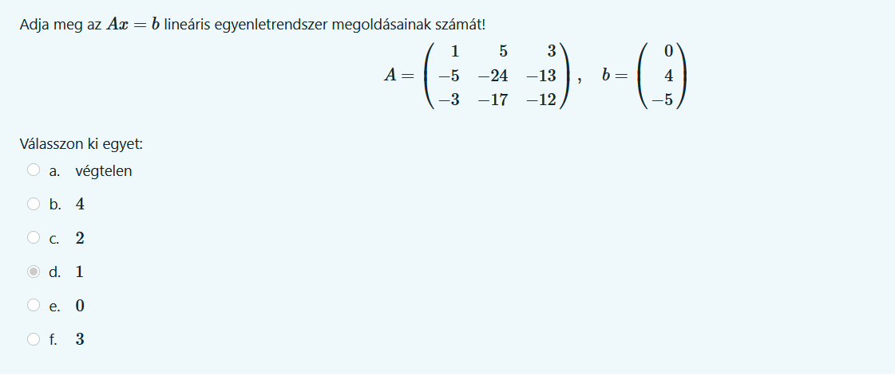

   Adott válasz: 1

   [Segítség](http://www.math.odu.edu/~bogacki/cgi-bin/lat.cgi?c=sys)

2. Ha az Ax=b lineáris egyenletrendszert szeretnénk megoldani, és a b vektor maximum 0.001 relatív hibával adott (∞-normában), akkor legfeljebb mennyi lehet a megoldás relatív hibája ∞-normában? A választ 4 tizedesjegyre kerekítve adja meg. 

    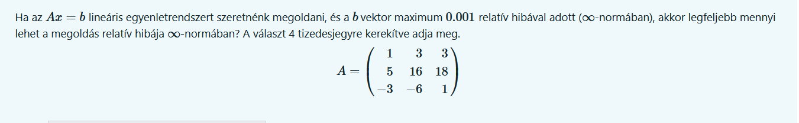

    Normák, kondíciószámok.pdf / 19. dia

    Adott válasz: 5,889

3. Adja meg az Ax=b lineáris egyenletrendszer megoldásainak számát!
    
    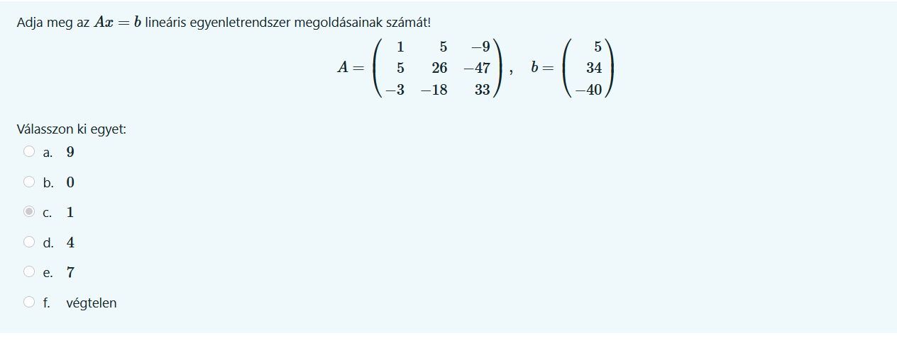

    Adott válasz: 1

    **A helyes válasz: 0**

    [Segítség](http://www.math.odu.edu/~bogacki/cgi-bin/lat.cgi?c=sys)

4. Készítse el a lenti A mátrix LU-felbontását. Mi lesz az u33 elem? 

    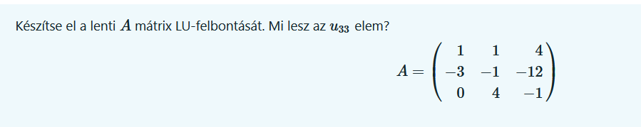

    Adott válasz: 0,1667

    **A helyes válasz: -1.**

    [Segítség](https://atozmath.com/MatrixEv.aspx?q=ludecomp)

5. Adja meg az alábbi mátrix ∞-normáját! 

    

    Adott válasz: 13

    Segítség (MATLAB)

    ```matlab
    m = [-2 -1 3
    1 1 -5
    -5 5 -3]

    norm(m,"Inf")
    ```

6. Adja meg az alábbi mátrix 1-normáját!

    

    Adott válasz: 10
    
    Segítség (MATLAB)

    ```matlab
    m = [-1 -4 -3
        5 1 -1
        -2 5 0]

    norm(m,1)
    ``` 

7. Adja meg az Ax=b lineáris egyenletrendszer megoldásainak számát!

    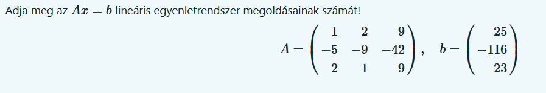

    Adott válasz: 1

    **Helyes válasz: végtelen**

    [Segítség](http://www.math.odu.edu/~bogacki/cgi-bin/lat.cgi?c=sys)

## Legkisebb négyzetes közelítések

1. Adott (t1,f1),...,(tm,fm) megfigyelésekre akarunk legkisebb négyzetes értelemben modellt illeszteni. Válassza ki azokat a modelleket, melyek az x1,x2,x3 ismeretlen paraméterek lineáris függvényei. 

    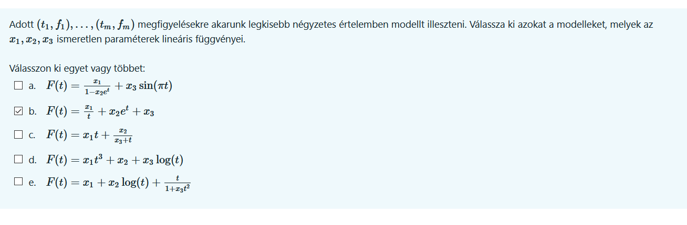

    Segítség:

    >Lineáris egy modell akkor ha minden tagja a kifejezésnek egy ezek közül:
    >
    >- Konstans
    >- Egy paraméter (x1, x2, stb) és egy paraméterektől független érték (sin(pi * t) -> t nem paraméter) szorzata

    Adott válasz: b, d

2. Milyen érteket vesz fel az alábbi adatokra legkisebb négyzetes értelemben legjobban illeszkedő egyenes az 4.5 helyen? Adja meg az egyenes meredekségét és konstanstagját is (válaszait két tizedesjegyre kerekítse).

    

    Segítség 1: Legkisebb négyzetek.pdf / 17. dia

    Segítség 2 (MATLAB):

    ```matlab
    t = [0 1 2 5 10]
    f = [0.54 1.6 2.71 5.79 11.08]

    p = polyfit(t, f, 1)
    polyval(p, 4.5)
    ```

    Adott válasz:
    - az egyenes meredeksége: 1,05
    - az egyenes konstanstagja: 0,56
    - a helyettesítési érték: 5,29

3. Milyen érteket vesz fel az alábbi adatokra legkisebb négyzetes értelemben legjobban illeszkedő legfeljebb másodfokú polinom az 3.0 helyen? Válaszát két tizedesjegyre kerekítve adja meg.

    

    Segítség (MATLAB):

    ```matlab
    t = [0 1 8 9 10]
    f = [1.65 4.4 116.19 145.43 177.81]

    p = polyfit(t, f, 2)
    polyval(p, 3)
    ```

    Adott válasz: 19,86

4. Milyen érteket vesz fel az alábbi adatokra legkisebb négyzetes értelemben legjobban illeszkedő F(t)=x1+x2sin(πt)+x3cos(πt) alakú modell az 0.2 helyen? Válaszát két tizedesjegyre kerekítve adja meg. 

    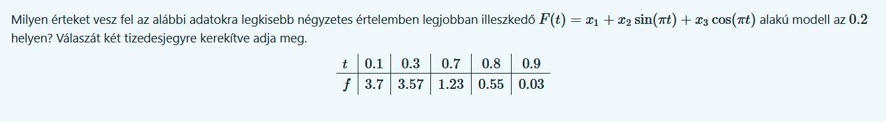

    Segítség 1: Legkisebb négyzetek.pdf / 29, 30. dia

    Segítség 2 (MATLAB):

    ```matlab
    t = [0.1 0.3 0.7 0.8 0.9]'
    f = [3.7 3.57 1.23 0.55 0.03]'

    A = [ones(5, 1), sin(pi * t), cos(pi * t)]

    x = (A' * A) \(A'*f)

    F=@(t) x(1) + x(2)*sin(pi*t) + x(3)*cos(pi*t)

    F(0.2)
    ```

    Adott válasz: 3,74

5. Milyen érteket vesz fel az alábbi adatokra legkisebb négyzetes értelemben legjobban illeszkedő F(t)=a+b/t
alakú modell az 10.0 helyen? Adja meg a modell paramétereit is (válaszait két tizedesjegyre kerekítse). 

    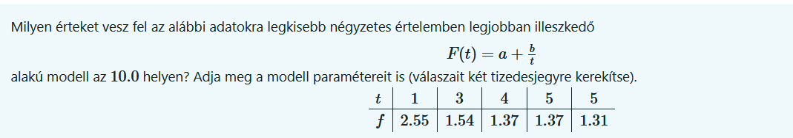

    Segítség (MATLAB):

    ```matlab
    t = [1 3 4 5 5]'

    f = [2.55 1.54 1.37 1.37 1.31]'

    A = [ones(5,1), 1./t]

    x = (A' * A) \(A'*f)

    F = @(t) x(1) + x(2)*(1./t)

    F(10)
    ```

    Adott válasz:

   - a= 1,02
   - b= 1,53
   - a helyettesítési érték: 1,18

    **Helyes válasz:**
    
    - a a helyettesítési érték: 1,17 (Google Számológép és a Matlab két hasonló értéket ad, csak másfele kerekülnek)

## Interpoláció

1. A(z) (−10,−4) és (−5,−7) pontokra szeretnénk egyenest illeszteni az Octave polyfit függvényével. Melyik a helyes parancs? 

    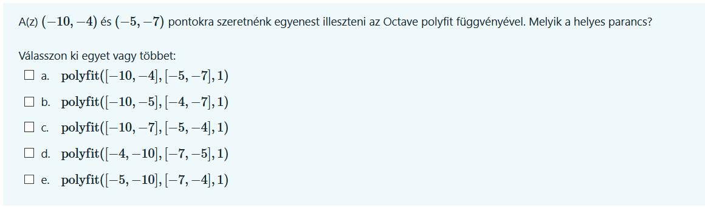

    Segítség: Interpoláció.pdf / 20. dia

    Adott válasz: b, e

2. Milyen érteket vesz fel a −2.0 helyen az a harmadfokú S spline, melyre S(−4)=26, S(0)=−2, S(3)=−11.0, S′(−4)=−27, S′(3)=6.0? 

    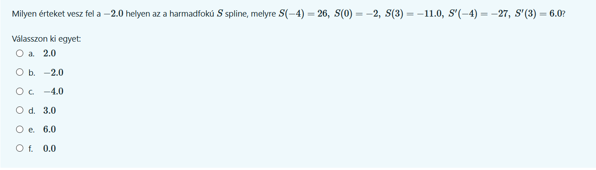

    Segítség 1: Interpoláció.pdf / 67. dia

    Segítség 2 (MATLAB):

    ```matlab
    x = [-4 0 3];
    y = [-27 26 -2 -11 6];

    p = spline(x,y,-2)
    ```

    Adott válasz: 0

3. Milyen érteket vesz fel a −4 helyen az a H polinom, melyre H(0)=3, H(2)=31, H′(0)=−4,H”(0)=6? 

    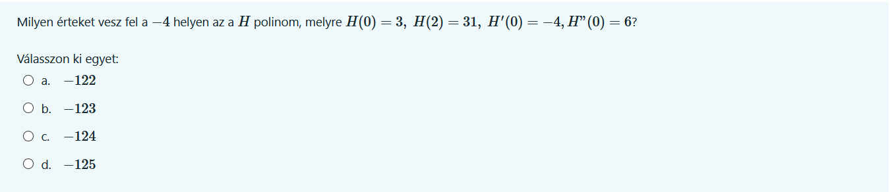

    Passz.

4. Milyen érteket vesz fel a(z) (9,−1) és (6,−10) pontokra illeszkedő egyenes a 7 helyen? 

    Segítség (MATLAB):
    ```matlab
    x = [9, 6];
    y = [-1, -10];

    p = polyfit(x, y, 1);

    polyval(p, 7)
    ```

    Adott válasz: -7

5. A −3x4−3x2−2x+1 polinom helyettesítési értékét a 3 helyen Horner-módszerrel számítva, a polinom 1-fokú tagja alatti mennyiség:

    Segítség 1: Interpoláció.pdf / 17., 18. dia

    Segítség 2 (MATLAB):
    ```matlab
    pp = [-3 0 -3 -2 1]
    polyval([-3 0 -3 -2], 3)
    ```

    Adott válasz: -92

6. Milyen érteket vesz fel a(z) (0,2), (−9,218) és (−8,170) pontkra illeszkedő (legfeljebb) másodfokú polinom a 7 helyen? 

    Segítség (MATLAB):

    ```matlab
    x = [0 -8 -9];
    y = [2 170 218];
    p = polyfit(x, y, 2);

    polyval(p, 7)
    ```

    Adott válasz: 170

7. Milyen érteket vesz fel a(z) (−6,−4), (−4,1) és (7,5) pontokra illesztett szakaszonként lineáris interpolációs polinom a −3 helyen? 

    Segítség (MATLAB):
    ```matlab
    x = [-4 7]
    y = [1 5]
    p = polyfit(x, y, 1);

    polyval(p, -3)
    ```

    Adott válasz: 1.364

8. Milyen érteket vesz fel a 3.7 helyen az a szakaszonként harmadfokú H Hermite-polinom, melyre H(0)=−1, H(1)=−3, H(4)=51, H′(0)=−2, H′(1)=−3, H′(4)=48?

    Segítség(kinda?) (MATLAB):
    ```matlab
    % pontos választ ad
    spline([1 4], [-3 -3 51 48], 3.7)
    ```

    ```matlab
    % nem ad pontos választ (lehet rossz???)
    x = [0 1 4];
    y = [-1 -1 51];
    pchip(x,y,3.7)
    ```

    Adott válasz: 37.743 

9. Milyen érteket vesz fel a −4 helyen az a H polinom, melyre H(−5)=−301, H(1)=5, H′(−5)=201,H′(1)=9? 

    Segítség (MATLAB):
    ```matlab
    spline([-5 1], [201 -301 5 9], -4)
    ```

    Adott válasz: -140

10. Mennyi a(z) (1,−2), (−9,1308), (8,−21952) és (3,−60) pontokra illeszkedő Lagrange-polinom főegyütthatója? 

    Segítség (MATLAB):
    
    ```matlab
    x = [1 -9 8 3];
    y = [-2 1308 -2195/2 -60];

    sum=0;
    for i=1:length(x)
        p=1;
        for j=1:length(x)
            if j~=i
                c = poly(x(j))/(x(i)-x(j));
                p = conv(p,c);
            end
        end
        term = p*y(i);
        sum= sum + term;
    end
    disp(sum);
    ```

    Adott válasz: -2

11. Milyen érteket vesz fel a −4 helyen az a H polinom, melyre H(−2)=−25, H(4)=−55, H′(−2)=19? 

    Passz.

## Numerikus integrálás

1. Mennyi az f függvény [0.0,1.0] intervallum feletti integráljának közelítése trapézképlettel, ha a lenti adatok ismertek? 

    

    Segítség: Numerikus integrálás.pdf / 6. dia

    Segítség 2(MATLAB):
    ```matlab
    x = [0 .2 .4 .6 .8 1];
    y = [3.2 1.7 3.4 2.5 1.8 3.2];

    trapz(x,y)
    ```

    Adott válasz: 2.52

2. Az integral függvény segítségével közelítse az alábbi integrál értékét! 

    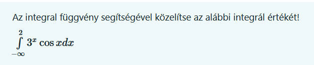

    Segítség: Numerikus integrálás.pdf / 21. dia (+ 18., 19.)

    Segítség 2 (MATLAB):
    ```matlab
    f = @(x) (3.^x).*cos(x);

    integral(f, -inf, 2)
    ```

    Adott válasz: 1.8437

3. Az integral2 függvény segítségével becsülje meg az alábbi integrál értékét. 

    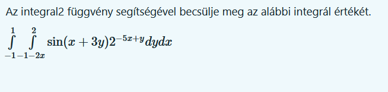

    Segítség: Numerikus integrálás.pd / 28., 29. dia

    Segítség 2 (MATLAB):
    ```matlab
    f = @(x, y) sin(x + 3.* y) .*2.^(-5.*x+y);
    ymin = @(x) -1 -2.*x;

    integral2(f, -1, 1, ymin, 2)
    ```

    Adott válasz: -7.7994

4. Az integral függvény segítségével közelítse az alábbi integrál értékét! 

    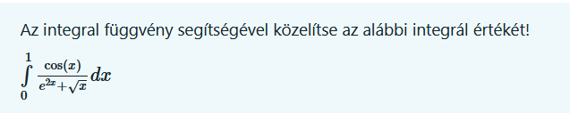

    Segítség: Numerikus integrálás.pdf / 21. dia

    Segítség 2 (MATLAB):

    ```matlab
    f = @(x) cos(x) ./ (exp(2.*x) + sqrt(x));

    integral(f, 0, 1)
    ```

    Adott válasz: 0.3162

5. Közelítse az alábbi integrál értékét az integral2 függvénnyel. 

    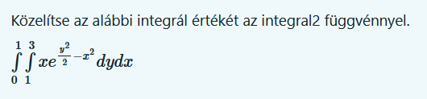

    Segítség (MATLAB):
    ```matlab
    f = @(x, y) x.* exp(((y.^2)./2)-(x.^2));

    integral2(f, 0, 1, 1, 3)
    ```

    Adott válasz: 10.808

## Sajátérték feladatok

1. Négy internetoldalat figyelve azt látjuk, hogy az egyes odalak a másik háromból a lent felsoroltakra hivatkoznak. Az oldalak súlyait rendszeresen újraszámoljuk úgy, hogy minden oldal az éppen rendelkezésre álló súlyát egyforma arányban osztja szét azon oldalaknak, amikre hivatkozik. Adjon meg egy stabil súlyeloszlást! 

    

    Segítség: Sajátérték feladatok.pdf  / 12., 13. dia

    Segítség (MATLAB): 

    ```matlab
    A = [0 1/2 1/3 1/3
        1/3 0 1/3 1/3
        1/3 1/2 0 1/3
        1/3 0 1/3 0];

    [v, u] = eig(A)
    % u legnagyobb pozitív értékéhez tartozó oszlop kell (ezesetben az 1.)
    ```

    Adott válasz: vT=[0.2813 0.25 0.2813 0.1875]

2. Adja meg az alábbi mátrix abszolútértékben legnagyobb sajátértékét!

    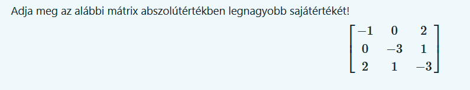

    Segítség (MATLAB):
    ```matlab
    A = [-1 0 2
    0 -3 1
    2 1 -3];

    u = eig(A);
    u
    ```

    Adott válasz: −4.681


3. Az alábbi A mátrix és v vektor esetén milyen λ-ra lesz minimális az Av−λv vektor euklideszi normája?

    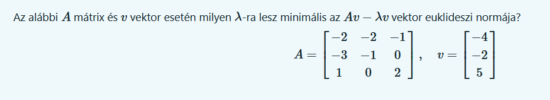

    Passz 

    Adott válasz: 

4. Adja meg az alábbi mátrix abszolútértékben legnagyobb sajátértékéhez tartozó sajátvektorát! 

    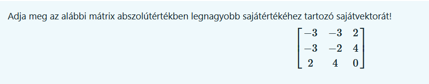

    Segítség (MATLAB):

    ```matlab
    A = [-3 -3 2
        -3 -2 4
        2 4 0];

    [v, u] = eig(A);
    v, u
    ```

    Adott válasz: vT=[−0.599 0.7986 −0.0589]

    **A helyes válasz: [−0.599−0.64020.4811]**

    Nem sort, oszlopot kell nézni

5. Egy populációban az egyedek maximum 3 évig élnek. A lenti A mátrix adja a populáció átmeneti mátrixát (ha egy adott évben x az 1, 2 és 3 éves egyedek számát tartalmazó vektor, akkor egy év múlva az egyedek száma várhatóan Ax). Válassza ki melyik vektor ad egy stabil koreloszlást. 

    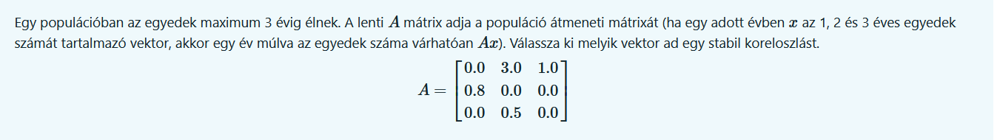

    Segítség: Sajátérték feladatok.pdf / 7-10. dia

    Segítség (MATLAB):

    ```matlab
    A = [0 3 1
        .8 0 0
        0 .5 0]

    [v, u] = eig(A);
    v;
    u;

    % u(1) > 0 --> v első oszlopát használjuk et használunk

    x = v(:,1);
    
    x / sum(x)
    ```

    Adott válasz: xT=[0.6086 0.2993 0.092]

## Nemlineáris egyenletek, optimalizálás

1. Adja meg a p(x)=x5+7x4+18x3+20x2+8x polinom második legnagyobb zérushelyét.

    

    Nemlineáris egyenletek / 40. dia

    ```matlab
    roots([1 7 18 20 8 0])
    ```

    Adott válasz: -1

2. Közelítse a cos(2x−1)−3sin(2x2+1)=0 egyenlet 0-hoz legközelebbi gyökét 4 tizedesjegy pontossággal!

    

    Nemlineáris egyenletek / 31., 32. dia

    ```matlab
    f = @(x) cos(2.*x - 1) - 3*sin(2.*(x.^2) + 1);

    [xpot, fopt] = fsolve(f, 0)

    xopt
    ```

    Adott válasz: 0,9884

3. Adja meg az f(x)=sin(x2−1)+xcos(x) függvény 0-hoz legközelebbi lokális minimumhelyét 4 tizedesjegyre kerekítve.

    

    Nemlineáris egyenletek / 36., 37. dia

    ```matlab
    f = @(x) sin((x.^2) - 1) +x.*cos(x);

    x = linspace(-10, 10, 1000);
    y = f(x);

    plot(x, y)

    [xmin, fval, a, b] = fminbnd(f, -1, 1)
    ```

    Adott válasz: -0,4729

4. Határozza meg az alábbi f függvény  [−2,2]×[−2,2]
-be eső lokális minimumai közül a legkisebbet! Az eredményt 4 tizedesjegyre adja meg.

    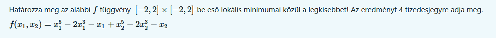

    f(x1,x2)=x51−2x31−x1+x52−2x32−x2

    ```matlab
    xx=linspace(-10,10, 1000);

    yy=xx;
    [X,Y]=meshgrid(xx,yy);
    Z=X.^5 - 2.*X.^3 - X + Y.^5-2.*Y.^3-Y
    figure; 
    contour(X,Y,Z)
    axis equal

    f = @(x) x(1).^5 - 2.*x(1).^3 -x(1) + x(2).^5-2.*x(2).^3-x(2);
    [xpot, fopt] = fminunc(f, [0.5 0.5])
    ```

    Adott válasz: -4,3629


## Lineráis programozás

1. Az alábbi feladathoz tartozó optimális szimplex táblázatot látjuk. 

    Egy bútoripari kisvállalkozás kétféle bútort gyárt:     komódot és tálalószekrényt. Egy tálalószekrény  előállításához 2 egységnyi faanyagra, 2 egység üvegre és 3   óra szakmunkára van szükség, míg egy komód elállításához 4    egység faanyagra és 2 óra szakmunkára. A rendelkezésre     álló kapacitások: 160 egység faanyag, 120 óra szakmunka és  60 egység üveg. Egy tálalószekrényt 60 Euróért,egy komódot   80 Euróért tudnak értékesíteni.

    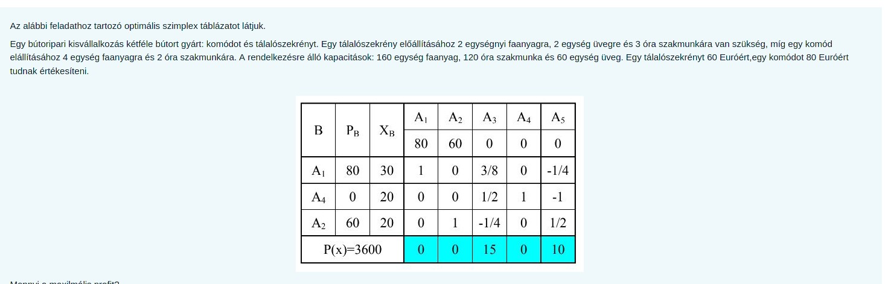

    ```matlab
    A = [2 4; 3 2; 2 0];
    b = [160; 120; 60];
    c = [-60; -80];
    also_kol = [0;0];
    [f, val, ~, ~, lambda] = linprog(c, A, b, [], [], als_kol);
    f 
    val
    ```

    Adott válasz: 3600

2. Oldja meg LinGoban a következő problémát és válaszoljon a kérdésre:

    Giapetto Fafaragó Cége kétfajta fából készült játékot   gyárt: katonákat és vonatokat. Egy katonát 27\$-ért lehet     eladni, és előállításához 10$ értékű nyersanyag szükséges   és minden legyártott katona 14\$-ral növeli Giapetto  költségeit. Egy vonat 21\$-ért adható el, előállításához     9\$ értékű nyersanyag szükséges és minden legyártott vonat  10$-ral növeli Giapetto költségeit. A vonatok és a katonák   gyártása kétféle szakmunkát igényel: Felületkezelő és     fafaragó munkát. Egy katona előállítása 2 óra   felületkezelő munkát és 1 óra fafaragó munkát igényel. Egy    vonathoz 1 óra felületkezelés és 1 óra fafaragás   szükséges. Giapettonak korlátlan mennyiségű nyersanyag áll    rendelkezésére, viszont csupán 100 felületkezelő óra és 80     fafaragó óra áll a rendelkezésére. A vonatok iránti     kereslet korlátlan, viszont a katonákból 40-nél többet nem  tud eladni. Adj tanácsot Giapettonak, hogy hány katonát és   hány vonatot gyártson, hogy a bevétele a legtöbb legyen!

    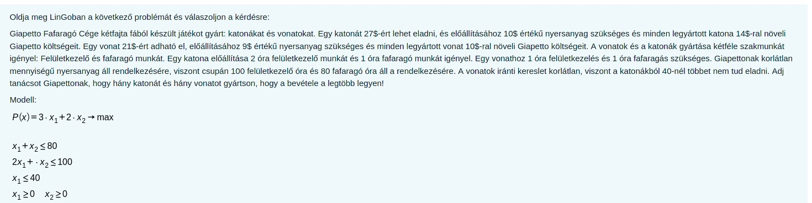

    ```matlab
        A = [1 1; 2 1];
        b = [80; 100];
        c = [-3; -2];
        als_kol = [0;0];

        [f, val, ~, ~, lambda] = linprog(c, A, b, [], [], als_kol);
        lambda.ineqlin
    ```

    Adott válasz: 1

    **A helyes válasz: 0**


3. Melyik LP modell tartozik az alábbi feladathoz?

    Egy kis ruházati vállalat konfekció öltönyöket és női   kosztümöket gyárt. Minden kosztümön 4 $ haszna van, míg   minden öltönyön 6 $. Minden öltöny 1 óra illetve minden   kosztüm három óra szabást igényel. Egy kiszabott kosztümöt    2, míg egy kiszabott öltönyt 1 óra alatt lehet megvarrni.  Heti termelési terv elkészítéséhez tudjuk, hogy egy héten    maximum 50 óra fordítható szabásra és 60 varrásra. Az  anyagból rendelkezésre álló mennyiség feltételezésünk    szerint korlátlan.

    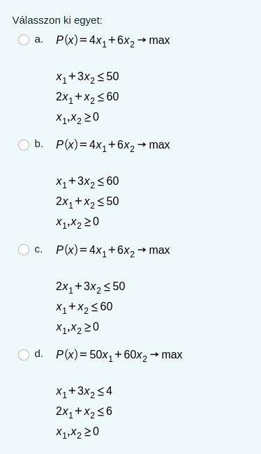

    Adott válasz: a

4. Oldja meg az alábbi feladatot Lingoban és válaszoljon a kérdésre.

    Juli néni gofrit és palacsintát árul a strandon. Két    alapanyag szükséges ezek előállításához: tej és liszt.     Minden eladott gofri után 50 forint és minden eladott   palacsinta után 40 forint profitja lesz. Egy gofrihoz 10   dkg liszt, 13 cl tej szükséges. Egy palacsintához 8 dkg   liszt, 6.5 cl tej szükséges. Viszont Juli néninek végesek     a készletei, így lisztből csak 8 kg, tejből 84.5 dl áll     rendelkezésre. Mennyi palacsintát és mennyi gofrit  csináljon, hogy maximális legyen a profitja?

    Válaszoljon a táblázat alapján az alábbi kérdésre:

    - Mennyi teje marad meg Juli néninek a táblázat által   javasolt optimális megoldás esetében?

    ```matlab
    A = [10 8; 13 6.5];
    b = [800; 84.5];
    c = [-50; -40];
    als_kor = [0;0];
    [f, val, ~, ~, lambda] = linprog(c, A, b, [], [], als_kol);
    f
    val
    ```

    Adott válasz: 0
